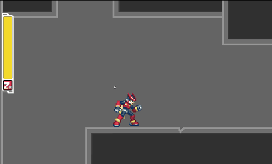
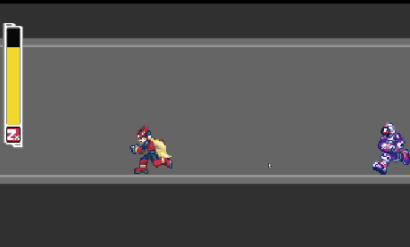
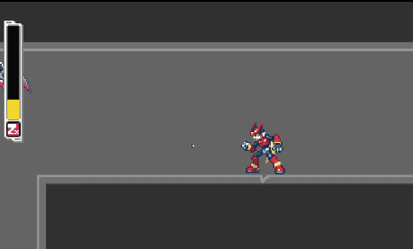
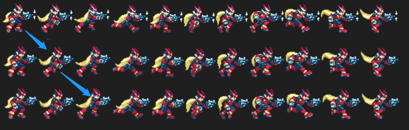
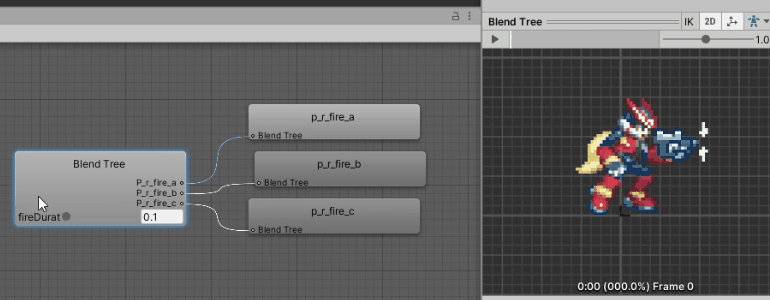
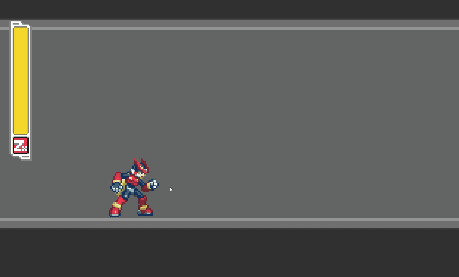
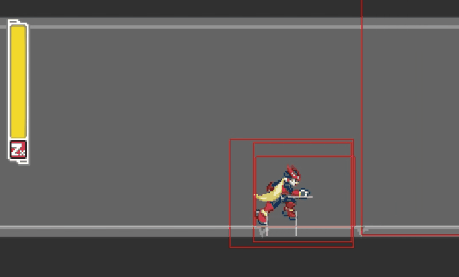
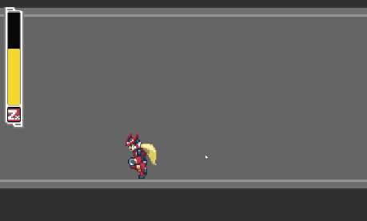

## Description

A fun project I made as I learn to use Unity and exlore its features. I have always been a fan of the MMZ series because of its artstyle, fluid movement and how crispy the control feels. The idea was to capture that control feel as much as possible in Unity2D rather than recreating the actual game. The original game isn't the most physically accurate so the physics simulation actually often gets in the way. Since I used a Rigidbody2D for the player controller, quite a bit of tweaking needs to be done to make it "less realistic" to achive a feel similar to the original game. It still needs tons of tweakings but I'm pretty happy with how it turned out so far. The player's sprite is actually from ZX but that's only because I really like the purple Z Saber. The combat is still based on the Zero games.

I initially tought about recreating an entire stage from the original game but couldn't find the sprites. Then I thought since the focus was really on recreating the movements, I might as well just draw some tilesets and make my own level. It's mostly just simple blocks due to my lack of drawing skill but I tried to make it feel somewhat self-contained and have some verticality to resemble those metroidvania styled levels.

The player character will slide on slopes due to physics simulation. One way I can think of to stop that is to do a raycast downwards and get the normal of the surface to see if the character is on a slope, and then restrict movements on x axis. 

For transition between scenes I used a scriptable object to perserve necessary data like player's health and spawn position. 

### Control:
| Key | Action |
| ------ | ----------- |
| Arrow keys   | Run |
|LShift| Dash (Hold to dash longer)|
|Space| Jump (Hold to jump higher)|
|Arrow while touching wall| Wall slide|
| X   | Fire (Available mid air/mid dash/running/wallsliding) |
| Z  | Slash (can combo up to 3 hits)|
| Z while wall sliding  |Wall Slash|
|Z while dashing| Dash Slash|
|Z while airborne| Air Slash|
|Down+Z while airborne| Circling air slash|

## Features
- Variable dashing and jumping
- Trails when dashing
- Attacks from the original game (projectiles, melee combo, circling slash etc.)
- Wall movements (sliding, jumping, slashing)
- State driven Enemies AIs
- Collectible item
- A simple level that involves a bit of backtracking

 \
 \
 
### Play trails when dashing
I created a player trail prefab and recorded an animation that gradually decreases the sprite's alpha to 0. When player enters dash state, a trail object is instantiated for every set period of time, it retrives the current sprite and transform from the player object and renders the animation. When the animation plays to it's completion, it calls the destroy function so trails won't stack up. 

### Syncing the firing and running animation
#### Managing variations within the run&fire state
Since the motions are not skeleton based, there are 3 set of sprites for the run shoot cylcle. For each frame in the sequence, there is a variation where shot is fired and you can see the spark and the slide is pushed back, one where the slide is on its way returning, and finally one when it's returned. 
  

I decided to use a blend tree to handles the variation and I used a "time passed after shot fired" variable as the blend parameter.
 

#### Managing transitions between run state and run&fire state
Run state and run&fire are two separate states so in order to make sure the player can transition smoothly into/out of firing state when running, the transition is handled manually in code by retrieving the current progress in the animation cycle and jumping to corresponding point in the target animation. \
 

### Enemey chasing
 

 

## Room for improvements
The player character initially only had very simple movements so most of the transitions were handled via a few condition checks and setting boolean variables to interact with the animator. However, as the complexity of the moveset increased, it became increasingly difficult to manage and result in hard to follow code and a spaghetti like animator. As I was writing the enemy character, I realized that writing a dedicated state machine in code for the behavior and lessening the reliance on the animator controller could be a feasible way to improve, though the player character has more variation in its states so it might need a bit more work to clearly plan out all the transition logic. I'm planning on refactoring the player character entirely once I had explored more options.
## References:
Player sprite: \
https://www.spriters-resource.com/ds_dsi/megamanzx/sheet/83/
\
Item sprite:\
https://www.spriters-resource.com/ds_dsi/megamanzx/sheet/52962/
\
Enemy sprite:\
http://www.sprites-inc.co.uk/sprite.php?local=Zero/Zero3/Enemy/ \
https://www.sprites-inc.co.uk/sprite.php?local=/ZX/ZX1/Enemy/

